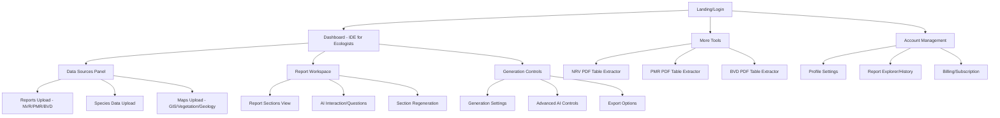
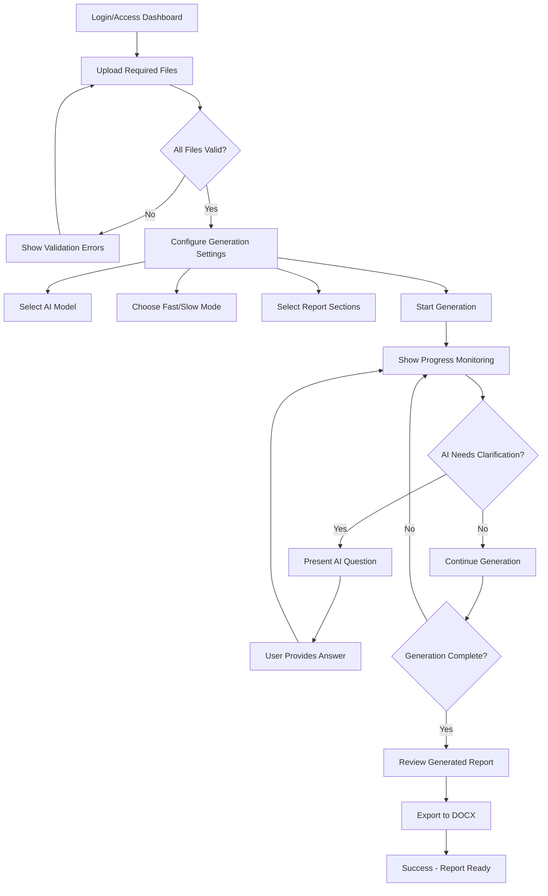

# EcoLogen UI/UX Specification

This document defines the user experience goals, information architecture, user flows, and visual design specifications for EcoLogen's user interface. It serves as the foundation for visual design and frontend development, ensuring a cohesive and user-centered experience.

## Overall UX Goals & Principles

### Target User Personas

- **Primary:** Field Ecologists (consultants, may not be tech-savvy, need efficiency)
- **Secondary:** Technical Specialists (want advanced options, hidden by default) 
- **Tertiary:** Business Stakeholders (SMEs guiding report requirements)

### Usability Goals

- Progressive disclosure: Hide complexity for basic users, reveal for advanced users
- File-centric workflow: Everything revolves around uploaded documents
- Real-time feedback: Show generation progress and allow monitoring on devices
- Professional output: Generate publication-ready DOCX reports

### Design Principles

1. **Clarity over complexity** - Clean, intuitive interface that doesn't overwhelm
2. **Progressive disclosure** - Advanced settings hidden but accessible
3. **File-centricity** - All workflows center around document management
4. **Professional reliability** - Interface conveys trust and expertise
5. **Eco-tech aesthetic** - Natural, earthy design that resonates with ecological work

### Change Log

| Date | Version | Description | Author |
|------|---------|-------------|--------|
| TBD | 1.0 | Initial specification | UX Expert |

## Information Architecture (IA)

### Site Map / Screen Inventory

### Navigation Structure

**Primary Navigation:** Report Generator (main), More Tools (dropdown), Account (dropdown)

**Secondary Navigation:** Within-tool navigation via panels and accordions

**Breadcrumb Strategy:** Minimal - tool name in header, section progress in workspace

## User Flows

### Complete Report Generation Flow

**User Goal:** Create a comprehensive ecological assessment report from uploaded documents and data

**Entry Points:** 
- Main dashboard after login
- "Report Generator" from header navigation

**Success Criteria:** 
- All required files uploaded and processed
- Complete report generated with all sections
- Professional DOCX export ready for client delivery

#### Flow Diagram

#### Edge Cases & Error Handling:
- File upload failures or invalid formats
- AI model unavailable or rate limits exceeded
- Generation timeout (5-20 minute processes)
- Missing required data for specific sections
- User abandons session during long generation
- Network interruption during upload/generation

**Notes:** This flow emphasizes the long-running nature of report generation and the importance of progress feedback. The human-in-the-loop AI clarification is a key differentiator.

## Wireframes & Mockups

**Primary Design Files:** Currently implementing directly in code with Shadcn UI components. For complex layouts or new features, consider using Figma for rapid prototyping before implementation.

### Key Screen Layouts

#### Main Dashboard - IDE for Ecologists

**Purpose:** Primary workspace where users spend most of their time generating and managing ecological reports

**Key Elements:**
- Glass-effect header with navigation and user controls
- Left panel: Collapsible data sources with upload areas organized by type (Reports, Species, Maps)
- Center panel: Report sections view with AI interaction callouts and section-by-section content
- Right panel: Generation controls with progressive disclosure of advanced settings
- Real-time progress indicators during generation phases

**Interaction Notes:** Three-panel layout should be responsive, with panels collapsing on smaller screens. File upload areas use drag-and-drop with clear validation feedback.

#### Report Section View (Center Panel)

**Purpose:** Display generated report content with clear section organization and regeneration capabilities

**Key Elements:**
- Section headers with regeneration controls
- AI clarification questions displayed as contextual callouts
- Progress indicators for in-progress sections
- Export preview with formatting indicators

**Interaction Notes:** Each section should be independently manageable with clear dependencies indicated between related sections.

## Component Library / Design System

**Design System Approach:** Shadcn UI base with custom eco-tech theme customizations. Leverage existing components while creating specialized components for ecological workflows (file upload areas, progress monitoring, AI interaction callouts).

### Core Components

#### FileDropzone Component

**Purpose:** Specialized file upload component for ecological documents with validation and preview

**Variants:** 
- Single file (NVR, PMR, BVD reports)
- Multiple file (TasVeg maps)  
- Large file (GIS/shapefile uploads)

**States:** 
- Default (empty with upload prompt)
- Drag hover (highlighted drop zone)
- Uploading (progress indicator)
- Success (file name with remove option)
- Error (validation message with retry)

**Usage Guidelines:** Use for all document uploads. Provide clear file type requirements and size limits. Show preview information when files are selected.

#### AIInteractionCallout Component

**Purpose:** Display AI questions and clarification requests during report generation

**Variants:**
- Question (amber styling with question icon)
- Information (blue styling with info icon)
- Warning (orange styling with warning icon)

**States:**
- Active (awaiting user response)
- Answered (collapsed with summary)
- Dismissed (hidden but retrievable)

**Usage Guidelines:** Use BotMessageSquare icon consistently. Provide clear response mechanisms. Allow users to revisit answered questions.

#### ProgressMonitor Component

**Purpose:** Show generation progress for long-running AI processes

**Variants:**
- Section-level progress (individual report sections)
- Overall progress (complete report generation)
- Real-time status (current AI operation)

**States:**
- Queued (waiting to start)
- Processing (active with progress bar)
- Complete (checkmark with timestamp)
- Error (error icon with retry option)

**Usage Guidelines:** Always show estimated time remaining. Provide detailed status messages. Allow cancellation where appropriate.

## Branding & Style Guide

### Visual Identity

**Brand Guidelines:** EcoLogen embodies professional ecological expertise through a refined, natural aesthetic that builds trust with scientific communities while remaining accessible to consultants and field workers.

### Color Palette

| Color Type | Hex Code | Usage |
|------------|----------|--------|
| Primary | `hsl(120, 30%, 40%)` | Deeper sage green - primary actions, focus states, branding |
| Secondary | `hsl(40, 20%, 82%)` | Muted earthy gray-brown - secondary elements, panels |
| Accent | `hsl(120, 30%, 55%)` | Richer muted green - highlights, interactive elements |
| Success | `hsl(120, 50%, 45%)` | Positive feedback, completed sections |
| Warning | `hsl(45, 80%, 60%)` | AI questions, important notices |
| Error | `hsl(0, 60%, 50%)` | Errors, validation failures |
| Background | `hsl(40, 25%, 88%)` | Main app background - warm, subdued |
| Card | `hsl(40, 30%, 92%)` | Panel backgrounds - softer cream |
| Border | `hsl(40, 15%, 78%)` | Subtle borders and dividers |

### Typography

#### Font Families
- **Primary:** Inter (clean, professional sans-serif for UI)
- **Secondary:** System UI fallbacks for performance
- **Monospace:** `ui-monospace, 'Cascadia Code'` for code/data display

#### Type Scale
| Element | Size | Weight | Line Height |
|---------|------|--------|-------------|
| H1 | 2rem (32px) | 700 (Bold) | 1.2 |
| H2 | 1.5rem (24px) | 600 (Semibold) | 1.3 |
| H3 | 1.25rem (20px) | 600 (Semibold) | 1.4 |
| Body | 0.875rem (14px) | 400 (Regular) | 1.6 |
| Small | 0.75rem (12px) | 400 (Regular) | 1.5 |

### Iconography

**Icon Library:** Lucide React - provides consistent, professional icons with ecological themes

**Usage Guidelines:** 
- Use `Leaf` for branding and nature-related elements
- Use `BotMessageSquare` for AI interactions
- Maintain 16px-24px sizing for UI elements
- Use semantic colors (primary for actions, muted for information)

### Spacing & Layout

**Grid System:** CSS Grid with named areas for three-panel layout (data-sources | workspace | controls)

**Spacing Scale:** Tailwind's default scale (0.25rem increments) with emphasis on generous whitespace for professional feel

## Accessibility Requirements

### Compliance Target

**Standard:** WCAG 2.1 AA compliance with selected AAA criteria for professional environments

### Key Requirements

**Visual:**
- Color contrast ratios: 4.5:1 for normal text, 3:1 for large text and UI components
- Focus indicators: Visible, high-contrast focus rings on all interactive elements (already implemented with your theme)
- Text sizing: Support browser zoom up to 200% without horizontal scrolling

**Interaction:**
- Keyboard navigation: Full keyboard operability with logical tab order through three-panel layout
- Screen reader support: Semantic HTML, proper ARIA labels, descriptive alt text for generated content
- Touch targets: Minimum 44px for mobile interactions (important for field work on tablets)

**Content:**
- Alternative text: Descriptive alt text for generated maps, charts, and GIS visualizations
- Heading structure: Logical hierarchy (H1 for page title, H2 for panel sections, H3 for subsections)
- Form labels: Clear, descriptive labels for all file upload areas and generation controls

### Testing Strategy

**Automated Testing:** Integrate axe-core accessibility testing in development workflow

**Manual Testing:** 
- Keyboard-only navigation testing for complete report generation workflow
- Screen reader testing with NVDA/JAWS for AI interaction callouts
- Color contrast verification for all theme variants (light/dark mode)
- Mobile accessibility testing for progress monitoring on tablets

**User Testing:** Include accessibility-focused testing with actual ecologists who use assistive technologies

## Responsiveness Strategy

### Breakpoints

| Breakpoint | Min Width | Max Width | Target Devices |
|------------|-----------|-----------|----------------|
| Mobile | 320px | 767px | Phones - progress monitoring, basic file management |
| Tablet | 768px | 1023px | Tablets - simplified three-panel layout, field work |
| Desktop | 1024px | 1439px | Standard desktop - full three-panel IDE experience |
| Wide | 1440px | - | Large monitors - enhanced workspace with more content visibility |

### Adaptation Patterns

**Layout Changes:**
- **Desktop:** Full three-panel layout (360px | 1fr | 320px grid)
- **Tablet:** Collapsible panels with tab-based navigation between data sources and controls
- **Mobile:** Single-column stack with bottom navigation for panel switching

**Navigation Changes:**
- **Desktop:** Full header with dropdown menus
- **Tablet:** Hamburger menu with slide-out navigation
- **Mobile:** Bottom tab bar for core functions (Upload, Progress, Account)

**Content Priority:**
- **Desktop:** All content visible simultaneously with rich interactions
- **Tablet:** Progressive disclosure with swipe gestures between panels
- **Mobile:** Focus on progress monitoring, basic file status, minimal upload capability

**Interaction Changes:**
- **Desktop:** Mouse-optimized with hover states and complex drag-and-drop
- **Tablet:** Touch-optimized with larger targets, gesture support for panel switching
- **Mobile:** Thumb-friendly navigation, simplified file upload, read-only progress view

## Animation & Micro-interactions

### Motion Principles

**Purposeful Motion:** All animations serve a functional purpose - progress indication, state transitions, or user feedback. No decorative animations that could distract from professional work.

**Performance Conscious:** Lightweight animations that don't impact the performance of long-running AI processes. Respect `prefers-reduced-motion` accessibility setting.

**Natural Feel:** Subtle, organic easing that reflects the natural, earthy brand aesthetic. Avoid overly mechanical or bouncy animations.

**Progress-Focused:** Emphasis on animations that help users understand long processes and system states.

### Key Animations

- **File Upload Progress:** Smooth progress bar with organic easing (Duration: 200-2000ms depending on file size, Easing: ease-out)
- **Panel Transitions:** Smooth sliding/fading when collapsing/expanding panels (Duration: 300ms, Easing: ease-in-out)
- **AI Callout Appearance:** Gentle fade-in with subtle slide for AI questions (Duration: 400ms, Easing: ease-out)
- **Generation Progress:** Pulsing progress indicators with color transitions (Duration: 1500ms, Easing: ease-in-out, infinite)
- **Section Completion:** Satisfying checkmark animation when sections complete (Duration: 600ms, Easing: ease-out with slight bounce)
- **Focus Transitions:** Smooth focus ring transitions for keyboard navigation (Duration: 150ms, Easing: ease-out)
- **Hover States:** Subtle scale/color transitions on interactive elements (Duration: 200ms, Easing: ease-out)
- **Glass Header Blur:** Dynamic backdrop-filter adjustments on scroll (Duration: 100ms, Easing: linear)

## Performance Considerations

### Performance Goals

- **Page Load:** Initial dashboard load under 2 seconds on standard connections
- **Interaction Response:** UI interactions respond within 100ms even during AI processing
- **Animation FPS:** Maintain 60fps for all animations, especially during background processing

### Design Strategies

**Progressive Loading:** 
- Load critical three-panel layout first, then enhance with advanced features
- Lazy load file preview components and advanced AI settings
- Progressive enhancement for complex visualizations

**Background Process Isolation:**
- Ensure UI remains fully responsive during 5-20 minute AI generation
- Use Web Workers or service workers for file processing where possible
- Implement proper loading states that don't block user interaction

**Efficient File Handling:**
- Stream large file uploads with chunked progress indicators
- Optimize file preview generation to avoid blocking main thread
- Implement client-side file validation before upload

**Memory Management:**
- Careful cleanup of large file objects after upload
- Efficient rendering of long report sections
- Optimize component re-renders during progress updates

**Network Optimization:**
- Implement smart polling for progress updates (start frequent, reduce over time)
- Use server-sent events for real-time AI clarification questions
- Optimize bundle splitting for faster initial load

## Next Steps

### Immediate Actions

1. **Stakeholder Review** - Present this specification to the development team and ecological SME for validation
2. **Technical Architecture Planning** - Work with Design Architect to create detailed frontend architecture document
3. **Component Development Priorities** - Begin with FileDropzone, AIInteractionCallout, and ProgressMonitor components
4. **Accessibility Implementation** - Set up axe-core testing and establish keyboard navigation patterns
5. **Performance Baseline** - Establish current performance metrics and monitoring

### Design Handoff Checklist

- [x] All user flows documented
- [x] Component inventory complete  
- [x] Accessibility requirements defined
- [x] Responsive strategy clear
- [x] Brand guidelines incorporated
- [x] Performance goals established

---

## 🎯 **UI/UX Specification Complete!**

This comprehensive specification provides the foundation for building EcoLogen's professional, accessible, and user-centered interface. The specification balances your requirements for:

- **Professional ecological workflows** with specialized components
- **Progressive disclosure** hiding complexity while maintaining power
- **Long-running AI processes** with robust progress monitoring
- **Multi-device support** from desktop IDE to mobile progress tracking
- **Accessibility and performance** for broad professional adoption

The specification is now ready for technical architecture planning and component development. Consider using this document as a living reference that evolves with user feedback and development insights.

**Ready for handoff to the development team!** 🌿
