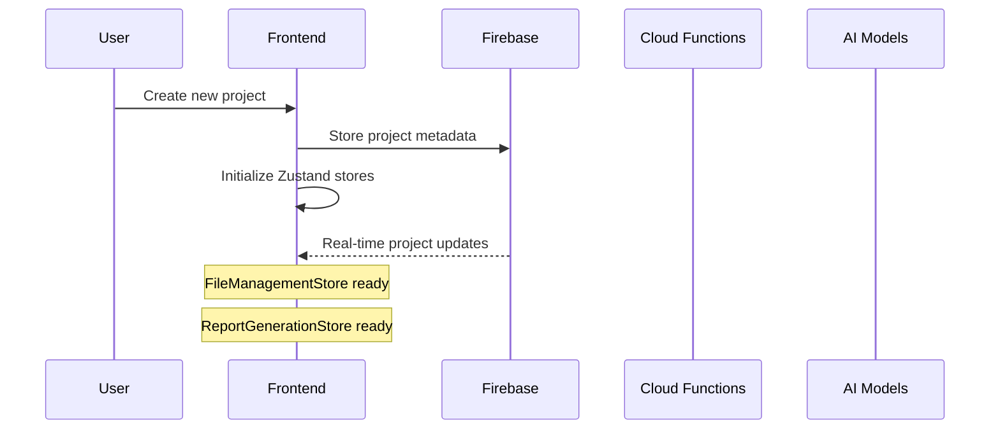
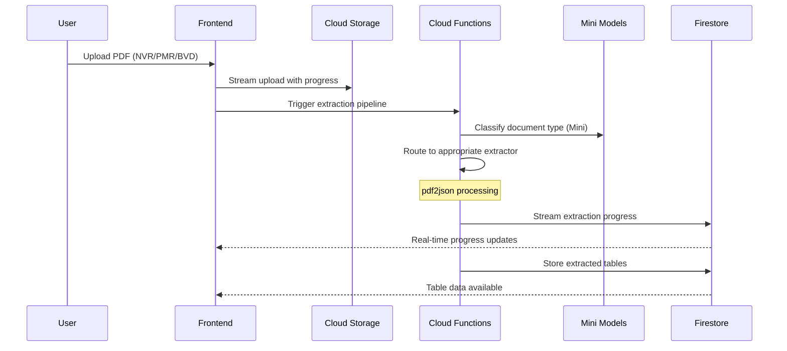
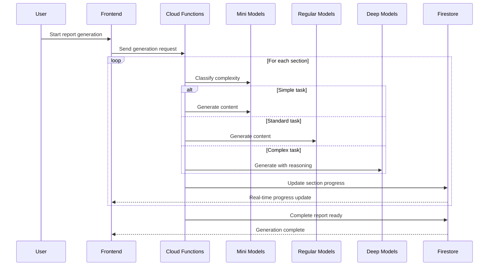

# Full-Stack Integration Architecture

## EcoLogen: Complete System Integration Guide

This document outlines how the frontend and backend architectures integrate to create a cohesive, production-ready AI-powered ecological report generation system.

---

## System Overview

### Architecture Alignment

**Frontend (Next.js + React + Zustand)**
- Three-panel "IDE for Ecologists" interface
- Real-time progress monitoring
- Human-in-the-loop AI interactions
- Domain-driven state management

**Backend (Firebase + Cloud Functions + Multi-tier AI)**
- Multi-tier agentic AI system (Mini/Regular/Deep models)
- PDF table extraction pipeline
- Australian data sovereignty
- Real-time WebSocket communication

**Integration Points:**
- Real-time bidirectional communication
- Shared TypeScript types and data models
- Coordinated state management between client and server
- Seamless file upload and processing workflows

---

## Data Flow Integration

### 1. Project Initialization Flow



### 2. File Upload & Processing Flow



### 3. AI Report Generation Flow



---

## Shared Type System

### Core Integration Types

```typescript
// Shared between frontend and backend
export interface EcologicalProject {
  id: string
  name: string
  location: GeoLocation
  client: ClientInfo
  createdAt: Date
  updatedAt: Date
  status: ProjectStatus
  reportSections: ReportSection[]
  extractedData: ExtractedTableData[]
  generationHistory: GenerationRun[]
  aiInteractions: AIQuestion[]
}

export interface ReportGenerationRequest {
  projectId: string
  sectionsToGenerate: string[]
  generationMode: 'fast' | 'thorough'
  templateDocument?: string
  customInstructions?: string
}

export interface AIGenerationProgress {
  projectId: string
  currentSection: string
  overallProgress: number
  sectionProgress: number
  modelTierUsed: 'mini' | 'regular' | 'deep'
  estimatedTimeRemaining: number
  status: 'initializing' | 'extracting' | 'generating' | 'validating' | 'complete' | 'error'
}

export interface AIQuestion {
  id: string
  projectId: string
  sectionId: string
  question: string
  context: string
  urgency: 'low' | 'medium' | 'high'
  modelTierRequired: 'mini' | 'regular' | 'deep'
  responses: UserResponse[]
  resolvedAt?: Date
}
```

### Frontend State Integration

```typescript
// ReportGenerationStore with backend integration
interface ReportGenerationState {
  // Local UI state
  activeProject: EcologicalProject | null
  generationProgress: AIGenerationProgress | null
  pendingQuestions: AIQuestion[]
  
  // Backend integration actions
  startGeneration: (request: ReportGenerationRequest) => Promise<void>
  respondToQuestion: (questionId: string, response: UserResponse) => Promise<void>
  subscribeToProgress: (projectId: string) => () => void
  
  // Real-time sync
  syncWithFirestore: boolean
  lastSyncTimestamp: Date
}
```

---

## Real-Time Communication Architecture

### WebSocket Integration Pattern

```typescript
// Frontend WebSocket service
class ReportGenerationWebSocket {
  private ws: WebSocket
  private reconnectAttempts = 0
  private maxReconnectAttempts = 5

  constructor(private store: ReportGenerationStore) {
    this.connect()
  }

  connect() {
    this.ws = new WebSocket(`${process.env.NEXT_PUBLIC_WS_URL}/progress`)
    
    this.ws.onmessage = (event) => {
      const data: AIGenerationProgress = JSON.parse(event.data)
      this.store.updateProgress(data)
    }

    this.ws.onclose = () => {
      if (this.reconnectAttempts < this.maxReconnectAttempts) {
        this.reconnectAttempts++
        setTimeout(() => this.connect(), 2000 * this.reconnectAttempts)
      }
    }
  }

  subscribeToProject(projectId: string) {
    this.ws.send(JSON.stringify({ 
      action: 'subscribe', 
      projectId 
    }))
  }
}
```

### Backend WebSocket Handler

```typescript
// Cloud Functions WebSocket handler
export const handleWebSocketConnection = functions
  .region('australia-southeast1')
  .https.onRequest(async (req, res) => {
    
    const io = new Server(res.socket.server)
    
    io.on('connection', (socket) => {
      socket.on('subscribe', ({ projectId }) => {
        socket.join(`project-${projectId}`)
      })
    })

    // Progress update broadcaster
    const broadcastProgress = (projectId: string, progress: AIGenerationProgress) => {
      io.to(`project-${projectId}`).emit('progress', progress)
    }
})
```

---

## API Integration Patterns

### 1. File Upload with Progress

```typescript
// Frontend file upload with real-time progress
export async function uploadFileWithProgress(
  file: File,
  onProgress: (progress: number) => void
): Promise<ExtractedTableData> {
  
  // Step 1: Upload to Cloud Storage
  const uploadTask = uploadBytesResumable(storageRef, file)
  
  uploadTask.on('state_changed', (snapshot) => {
    const progress = (snapshot.bytesTransferred / snapshot.totalBytes) * 50
    onProgress(progress) // First 50% is upload
  })

  await uploadTask

  // Step 2: Trigger extraction
  const extractionResult = await fetch('/api/extract-tables', {
    method: 'POST',
    body: JSON.stringify({ filePath: uploadTask.snapshot.ref.fullPath })
  })

  // Step 3: Poll for completion (remaining 50%)
  return pollForExtraction(extractionResult.id, (progress) => {
    onProgress(50 + progress * 0.5)
  })
}
```

### 2. Multi-tier AI Generation

```typescript
// Backend AI orchestration
class AgenticReportGenerator {
  async generateSection(
    section: ReportSection,
    context: EcologicalContext,
    projectId: string
  ): Promise<GeneratedContent> {
    
    // Step 1: Complexity classification (Mini model)
    const complexity = await this.classifyComplexity(section)
    
    // Step 2: Select appropriate model tier
    const modelTier = this.selectModelTier(complexity, section.importance)
    
    // Step 3: Update progress
    await this.updateProgress(projectId, {
      currentSection: section.id,
      modelTierUsed: modelTier,
      status: 'generating'
    })
    
    // Step 4: Generate with escalation capability
    let result = await this.generateWithTier(modelTier, section, context)
    
    // Step 5: Quality check and potential escalation
    if (result.needsDeepThinking && modelTier !== 'deep') {
      result = await this.generateWithTier('deep', section, context)
    }
    
    return result
  }
}
```

---

## Component Integration Examples

### 1. FileDropzone with Backend Integration

```typescript
// Frontend component with full backend integration
export function FileDropzone() {
  const { uploadFile, extractionProgress } = useFileManagement()
  const [isUploading, setIsUploading] = useState(false)
  
  const handleDrop = async (files: File[]) => {
    setIsUploading(true)
    
    for (const file of files) {
      try {
        // Upload with real-time progress
        const extractedData = await uploadFileWithProgress(file, (progress) => {
          // Progress automatically synced via Zustand store
        })
        
        // Trigger AI classification (Mini model)
        await classifyDocument(extractedData.id)
        
      } catch (error) {
        toast.error(`Failed to process ${file.name}`)
      }
    }
    
    setIsUploading(false)
  }

  return (
    <div className="border-2 border-dashed border-muted-foreground/25 rounded-lg p-8">
      {/* Dropzone UI with real-time progress from Zustand store */}
      {extractionProgress && (
        <ProgressBar 
          value={extractionProgress.percentage}
          status={extractionProgress.stage}
        />
      )}
    </div>
  )
}
```

### 2. AIInteractionCallout with Multi-tier Logic

```typescript
// AI clarification component with backend intelligence
export function AIInteractionCallout({ question }: { question: AIQuestion }) {
  const { respondToQuestion } = useAIInteraction()
  const [isResponding, setIsResponding] = useState(false)
  
  const handleResponse = async (response: UserResponse) => {
    setIsResponding(true)
    
    try {
      // Backend automatically selects appropriate model tier
      // based on question complexity and urgency
      await respondToQuestion(question.id, response)
      
      // Continue generation with updated context
      // Mini model handles simple clarifications
      // Regular/Deep models handle complex ecological questions
      
    } catch (error) {
      toast.error('Failed to process response')
    } finally {
      setIsResponding(false)
    }
  }

  return (
    <Card className="border-amber-200 bg-amber-50">
      <CardHeader>
        <div className="flex items-center gap-2">
          <AlertCircle className="h-4 w-4 text-amber-600" />
          <Badge variant="outline">
            {question.modelTierRequired} Model Required
          </Badge>
        </div>
      </CardHeader>
      {/* Interactive response UI */}
    </Card>
  )
}
```

### 3. ProgressMonitor with Multi-tier Visibility

```typescript
// Progress component showing AI model tier usage
export function ProgressMonitor({ projectId }: { projectId: string }) {
  const progress = useRealtimeProgress(projectId)
  
  return (
    <Card>
      <CardHeader>
        <CardTitle>Generation Progress</CardTitle>
      </CardHeader>
      <CardContent>
        <div className="space-y-3">
          <Progress value={progress.overallProgress} />
          
          <div className="flex items-center justify-between text-sm">
            <span>Current: {progress.currentSection}</span>
            <Badge variant={
              progress.modelTierUsed === 'deep' ? 'default' :
              progress.modelTierUsed === 'regular' ? 'secondary' : 'outline'
            }>
              {progress.modelTierUsed} Model
            </Badge>
          </div>
          
          <div className="text-xs text-muted-foreground">
            Est. {Math.round(progress.estimatedTimeRemaining / 60)}min remaining
          </div>
        </div>
      </CardContent>
    </Card>
  )
}
```

---

## Error Handling & Resilience

### Multi-tier Fallback Strategy

```typescript
// Backend error handling with model tier fallbacks
class ResilientAIOrchestrator {
  async generateWithResilience(
    section: ReportSection,
    context: EcologicalContext
  ): Promise<GeneratedContent> {
    
    const providers = ['claude', 'openai', 'gemini', 'deepseek']
    const tiers = ['mini', 'regular', 'deep']
    
    for (const provider of providers) {
      for (const tier of tiers) {
        try {
          return await this.generateWithProviderTier(provider, tier, section, context)
        } catch (error) {
          console.warn(`${provider}:${tier} failed, trying next option`)
          
          // Track failures for intelligent routing
          await this.recordFailure(provider, tier, error)
        }
      }
    }
    
    throw new Error('All AI providers failed')
  }
}
```

### Frontend Error Recovery

```typescript
// Frontend resilience with graceful degradation
export function useResilientGeneration() {
  const { retryGeneration, fallbackToManual } = useReportGeneration()
  
  const handleGenerationError = async (error: GenerationError) => {
    if (error.type === 'ai_provider_failure') {
      // Automatic retry with different provider
      return await retryGeneration(error.sectionId)
    }
    
    if (error.type === 'complexity_too_high') {
      // Escalate to deep model or manual intervention
      return await escalateToDeepModel(error.sectionId)
    }
    
    if (error.type === 'data_extraction_failure') {
      // Allow manual data entry with AI assistance
      return await fallbackToManual(error.documentId)
    }
  }
}
```

---

## Performance Optimization

### 1. Intelligent Caching Strategy

```typescript
// Multi-layer caching across the stack
interface CacheStrategy {
  // Frontend caching
  zustandPersistence: boolean
  componentMemoization: boolean
  queryClientCaching: boolean
  
  // Backend caching
  firebaseLocalCache: boolean
  cloudFunctionWarmup: boolean
  aiResponseCaching: boolean
  
  // Multi-tier AI caching
  miniModelResults: '1hour'
  regularModelResults: '30min'
  deepModelResults: '24hour'
}
```

### 2. Progressive Loading

```typescript
// Load critical data first, enhance progressively
export function ProjectDashboard({ projectId }: { projectId: string }) {
  // Critical data - load immediately
  const { project, isLoading } = useProject(projectId)
  
  // Enhanced data - load in background
  const { extractedTables } = useExtractedTables(projectId, { 
    enabled: !!project,
    staleTime: 5 * 60 * 1000 // 5 minutes
  })
  
  // AI insights - load last, cache aggressively
  const { aiInsights } = useAIInsights(projectId, {
    enabled: !!extractedTables,
    staleTime: 60 * 60 * 1000 // 1 hour
  })
  
  return (
    <div className="space-y-6">
      {/* Render progressively as data becomes available */}
    </div>
  )
}
```

---

## Security Integration

### 1. End-to-End Data Protection

```typescript
// Coordinated security across frontend and backend
interface SecurityLayer {
  // Frontend security
  authentication: 'Firebase Auth'
  routeProtection: 'Next.js middleware'
  sensitiveDataMasking: 'client-side redaction'
  
  // Backend security
  dataEncryption: 'field-level encryption'
  accessControl: 'Firebase Security Rules'
  auditLogging: 'Cloud Audit Logs'
  
  // Cross-layer security
  apiAuthentication: 'Firebase ID tokens'
  dataValidation: 'Zod schemas (shared)'
  rateLimiting: 'Cloud Functions + frontend'
}
```

### 2. Australian Compliance Integration

```typescript
// Ensure all data stays in Australia
export const AUSTRALIA_COMPLIANCE = {
  // Frontend config
  firebaseConfig: {
    region: 'australia-southeast1'
  },
  
  // Backend config
  cloudFunctions: {
    region: 'australia-southeast1',
    availabilityType: 'australia-southeast2' // DR
  },
  
  // AI provider config
  openai: { endpoint: 'australia-southeast1.openai.azure.com' },
  claude: { endpoint: 'bedrock.ap-southeast-2.amazonaws.com' },
  gemini: { endpoint: 'australia-southeast1-aiplatform.googleapis.com' }
} as const
```

---

## Deployment Integration

### Frontend Deployment (Vercel)

```bash
# vercel.json
{
  "builds": [
    {
      "src": "next.config.mjs",
      "use": "@vercel/next"
    }
  ],
  "env": {
    "NEXT_PUBLIC_FIREBASE_REGION": "australia-southeast1",
    "NEXT_PUBLIC_WS_URL": "wss://australia-southeast1-ecologen.cloudfunctions.net"
  },
  "regions": ["syd1"]
}
```

### Backend Deployment (Firebase)

```bash
# firebase.json
{
  "functions": {
    "source": "functions",
    "runtime": "nodejs20",
    "region": "australia-southeast1"
  },
  "firestore": {
    "rules": "firestore.rules",
    "indexes": "firestore.indexes.json"
  },
  "storage": {
    "rules": "storage.rules"
  }
}
```

---

## Implementation Checklist

### Phase 1: Foundation Integration (Weeks 1-3)
- [ ] Shared TypeScript types package
- [ ] Zustand store with Firebase real-time integration
- [ ] File upload pipeline with progress tracking
- [ ] PDF extraction Cloud Function wrapper
- [ ] Basic WebSocket communication
- [ ] Australian region configuration

### Phase 2: AI Integration (Weeks 4-6)
- [ ] Multi-tier AI provider abstraction
- [ ] Model tier selection logic
- [ ] Human-in-the-loop question system
- [ ] Real-time progress updates
- [ ] Error handling and fallback chains
- [ ] Cost tracking and optimization

### Phase 3: Production Features (Weeks 7-9)
- [ ] Complete security integration
- [ ] Performance optimization
- [ ] Advanced caching strategies
- [ ] Monitoring and analytics
- [ ] Quality assurance pipelines
- [ ] Mobile responsiveness

### Phase 4: Scale & Polish (Weeks 10-12)
- [ ] Load testing and optimization
- [ ] Advanced AI features
- [ ] User experience polish
- [ ] Documentation and training
- [ ] Compliance verification
- [ ] Production deployment

---

## Success Metrics

**Integration Health:**
- [ ] < 500ms latency for real-time updates
- [ ] 99.9% uptime for critical workflows
- [ ] < 2s initial page load time
- [ ] 100% type safety across frontend/backend boundary

**AI Performance:**
- [ ] 70%+ tasks handled by mini models (cost optimization)
- [ ] < 30s average response time for regular models
- [ ] 95%+ accuracy for ecological content validation
- [ ] < 5% escalation rate from regular to deep models

**User Experience:**
- [ ] Seamless file upload and processing
- [ ] Real-time progress updates without lag
- [ ] Intuitive AI question-response workflows
- [ ] Mobile-friendly progress monitoring

---

## 🎯 **Ready for Implementation!**

This full-stack integration architecture provides a complete blueprint for building EcoLogen as a production-ready, enterprise-grade AI-powered ecological reporting system. The multi-tier agentic AI approach, combined with robust real-time communication and Australian compliance, creates a system that's both technically sophisticated and practically valuable for ecological consultants.

**Key Integration Strengths:**
- **Seamless data flow** between frontend state and backend AI processing
- **Real-time communication** for long-running AI generation processes
- **Multi-tier AI optimization** with intelligent cost and quality management
- **Production-ready patterns** for security, performance, and compliance
- **Clear implementation roadmap** with 12-week timeline and checkpoints

**The system is architected to scale from MVP to enterprise while maintaining the specific requirements of Australian ecological consulting workflows.** 🌿🚀